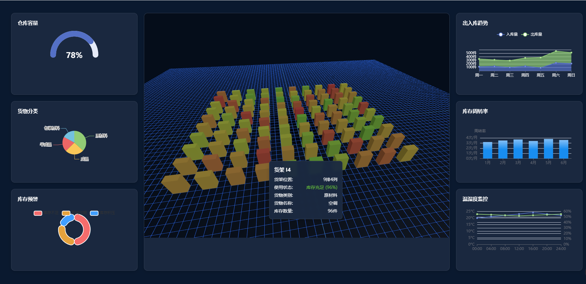

# 3D仓库管理系统

## 项目简介

3D仓库管理系统是一个基于Vue3和Three.js的现代化仓库管理解决方案。该系统提供了直观的3D可视化界面，实时展示仓库布局、货物存放状态，并集成了完整的仓库管理功能，帮助企业高效管理仓储业务。



## 功能特点

### 3D可视化
- 实时3D仓库布局展示
- 货架和货物的立体可视化
- 交互式货物查询和管理
- 支持缩放、旋转等视角操作

### 仓库管理
- 多仓库切换和管理
- 货物分类管理（原材料、成品、半成品、包装材料）
- 实时库存监控
- 库存预警系统

### 数据分析
- 仓库容量统计
- 货物分类分析
- 出入库趋势图表
- 库存周转率分析
- 温湿度环境监控

## 技术栈

- **前端框架**: Vue 3
- **构建工具**: Vite
- **3D引擎**: Three.js
- **UI组件**: Element Plus
- **图表库**: ECharts
- **动画库**: GSAP
- **工具库**: VueUse

## 快速开始

### 环境要求
- Node.js >= 16.0.0
- npm >= 7.0.0

### 安装步骤

1. 克隆项目
```bash
git clone https://github.com/yourusername/3d-warehouse-management.git
cd 3d-warehouse-management
```

2. 安装依赖
```bash
npm install
```

3. 启动开发服务器
```bash
npm run dev
```

4. 构建生产版本
```bash
npm run build
```

## 项目结构

```
3d-warehouse-management/
├── src/                    # 源代码目录
│   ├── components/        # 组件目录
│   ├── App.vue           # 根组件
│   └── main.js           # 入口文件
├── public/                # 静态资源
├── index.html            # HTML模板
├── vite.config.js        # Vite配置
└── package.json          # 项目配置文件
```

## 核心功能说明

### 仓库布局
系统使用Three.js创建3D仓库场景，包括：
- 可配置的货架布局（行数、列数）
- 自定义货架尺寸和间距
- 支持多层货架结构

### 货物管理
支持多种货物类型：
- 原材料（钢材、铝材、塑料粒子等）
- 成品（电视机、冰箱、洗衣机等）
- 半成品（主板、显示屏、电机等）
- 包装材料（纸箱、泡沫、塑料袋等）

### 数据可视化
集成ECharts实现多维度数据展示：
- 容量利用率图表
- 分类统计饼图
- 出入库趋势线图
- 库存周转率分析图
- 环境监控实时图表

## 开发指南

### 组件开发
1. 所有组件都应该使用Vue 3的组合式API
2. 使用TypeScript进行类型检查
3. 遵循Element Plus的设计规范

### 3D场景开发
1. 使用Three.js的最佳实践
2. 实现高性能的场景渲染
3. 优化模型加载和交互响应

## 部署说明

### 开发环境
- 使用Vite的开发服务器
- 支持热模块替换（HMR）
- 开发时自动编译和刷新

### 生产环境
1. 执行构建命令生成静态文件
2. 部署dist目录到Web服务器
3. 配置正确的base URL

## 贡献指南

欢迎贡献代码，请遵循以下步骤：
1. Fork项目
2. 创建特性分支
3. 提交更改
4. 推送到分支
5. 创建Pull Request

## 许可证

本项目基于MIT许可证开源。

## 联系方式

如有问题或建议，请通过以下方式联系：
- 提交Issue

## 更新日志

### v0.0.1
- 初始版本发布
- 实现基础3D仓库展示
- 集成基本的数据可视化功能
